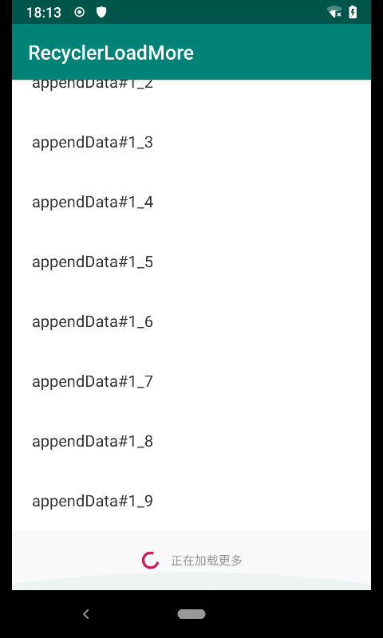
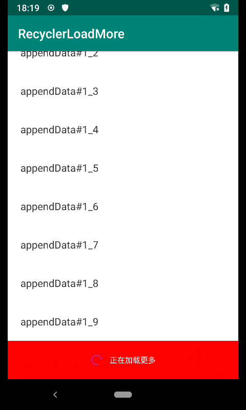
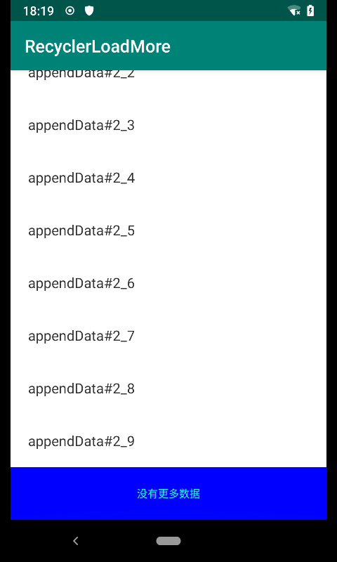

## Integration
``` xml

dependencies {
    implementation "com.cabe.lib.ui:RecyclerLoadMore:<last_version>"
}

``` 

## Usage


``` xml

		<com.cabe.lib.ui.widget.LoadMoreRecyclerView
			android:id="@+id/activity_main_recycler"
			android:layout_width="match_parent"
			android:layout_height="match_parent"
			tools:listitem="@layout/item_layout_view"
			app:autoLoad="false|true"
			app:showEnd="false|true"
			app:spanCount="3"
			app:layoutManager="android.support.v7.widget.GridLayoutManager"/>

```

``` kotlin

        recyclerView = findViewById<LoadMoreRecyclerView>(R.id.activity_main_recycler)
        recyclerView.setScrollCallback(RecyclerViewScrollCallback)

```

### Feature

设置自定义LoadView样式

默认加载样式<br/><br/>


自定义加载样式<br/><br/>


``` kotlin

        recyclerView.setOnLoadViewListener(object: OnLoadViewListener() {
            override fun onCreateLoadView(parent: ViewGroup): View? {
                //如果返回null，则显示默认样式
                return null
            }
            override fun void onLoadViewBind(loadView: View) {
            }
        })
    
```

设置自定义EndView样式

默认结尾样式<br/><br/>


自定义结尾样式<br/><br/>


``` kotlin

        recyclerView.setOnEndViewListener(object: OnEndViewListener() {
            override fun onCreateEndView(parent: ViewGroup): View? {
                //如果返回null，则显示默认样式
                return null
            }
            override fun void onEndViewBind(endView: View) {
            }
        })
    
```